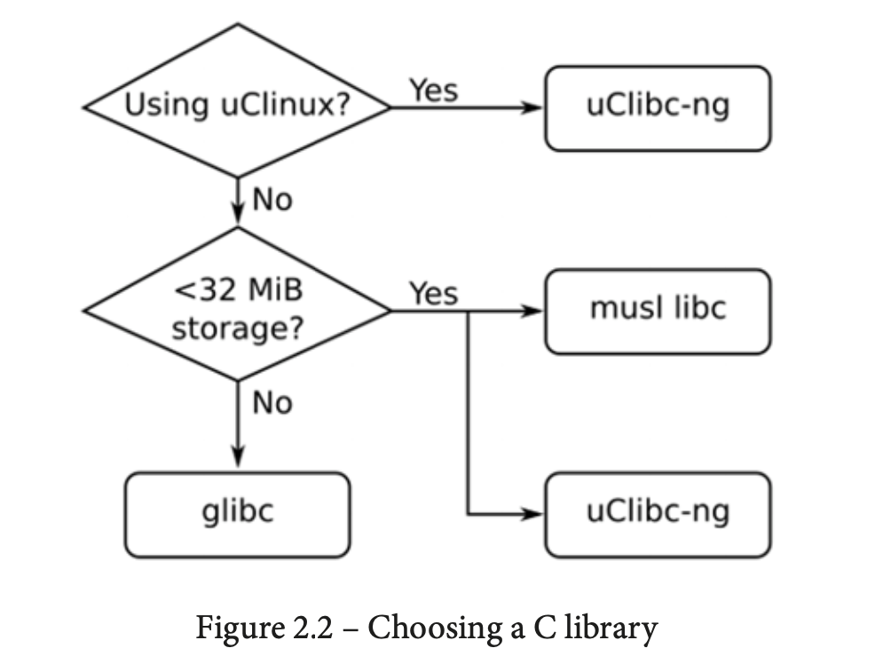

# Notes

<!-- mtoc-start -->

* [1. Starting Out](#1-starting-out)
* [2. Toolchains](#2-toolchains)
  * [Page 18](#page-18)
  * [Page 26](#page-26)

<!-- mtoc-end -->

## 1. Starting Out

The four elements of embedded Linux:

1. Toolchain: The compiler and other tools needed to create code for your target
   device.

2. Bootloader: The program that initializes the board and loads the Linux
   kernel.

3. Kernel: This is the heart of the system, managing system resources and
   interfacing with hardware.

4. Root filesystem: Contains the libraries and programs that are run once the
   kernel has completed its initialization.

```conn
$ gcc -dumpmachine
x86_64-linux-gnu
```



## 2. Toolchains

### Page 18

```console
sudo apt update
sudo apt install autoconf automake bison bzip2 cmake \
    flex g++ gawk gcc gettext git gperf help2man libncurses5-dev \
    libstdc++6 libtool libtool-bin make patch python3-dev rsync \
    texinfo unzip wget xz-utils
```

### Page 26

> Some years ago, Dan Kegel wrote a set of scripts and makefiles for generating cross- development toolchains and called it crosstool (http://kegel.com/crosstool/). In 2007, Yann E. Morin used that base to create the next generation of crosstool, crosstool-NG (https://crosstool-ng.github.io). Today it is by far the most convenient way to create a standalone cross toolchain from source.

```console
git clone https://github.com/crosstool-ng/crosstool-ng.git
cd crosstool-ng
git checkout crosstool-ng-1.24.0
./bootstrap
./configure --prefix=${PWD}
make
make install
```

```console
utm@utm:~/crosstool-ng$ bin/ct-ng list-samples
Status  Sample name
[L...]   aarch64-rpi3-linux-gnu
[L..X]   aarch64-unknown-linux-android
[L...]   aarch64-unknown-linux-gnu
[L...]   aarch64-unknown-linux-uclibc
[L...]   alphaev56-unknown-linux-gnu
[L...]   alphaev67-unknown-linux-gnu
[L...]   arc-arc700-linux-uclibc
[L...]   arc-multilib-elf32
[L...]   arc-multilib-linux-uclibc
[L...]   arm-bare_newlib_cortex_m3_nommu-eabi
[L...]   arm-cortex_a15-linux-gnueabihf
[L...]   arm-cortex_a8-linux-gnueabi
[L..X]   arm-cortexa5-linux-uclibcgnueabihf
[L..X]   arm-cortexa9_neon-linux-gnueabihf
[L..X]   x86_64-w64-mingw32,arm-cortexa9_neon-linux-gnueabihf
[L...]   arm-multilib-linux-uclibcgnueabi
[L...]   arm-nano-eabi
[L...]   arm-unknown-eabi
[L...]   arm-unknown-linux-gnueabi
[L..X]   arm-unknown-linux-musleabi
[L...]   arm-unknown-linux-uclibcgnueabi
[L..X]   arm-unknown-linux-uclibcgnueabihf
[L...]   armeb-unknown-eabi
[L...]   armeb-unknown-linux-gnueabi
[L...]   armeb-unknown-linux-uclibcgnueabi
[L...]   armv6-nommu-linux-uclibcgnueabi
[L...]   armv6-rpi-linux-gnueabi
[L...]   armv7-rpi2-linux-gnueabihf
[L...]   armv8-rpi3-linux-gnueabihf
[L...]   avr
[L...]   i586-geode-linux-uclibc
[L...]   i686-centos6-linux-gnu
[L...]   i686-centos7-linux-gnu
[L...]   i686-nptl-linux-gnu
[L...]   i686-ubuntu12.04-linux-gnu
[L...]   i686-ubuntu14.04-linux-gnu
[L...]   i686-ubuntu16.04-linux-gnu
[L..X]   i686-w64-mingw32
[L...]   m68k-unknown-elf
[L...]   m68k-unknown-uclinux-uclibc
[L...]   powerpc-unknown-linux-uclibc,m68k-unknown-uclinux-uclibc
[L...]   mips-ar2315-linux-gnu
[L...]   mips-malta-linux-gnu
[L...]   mips-unknown-elf
[L...]   mips-unknown-linux-uclibc
[L...]   mips64el-multilib-linux-uclibc
[L...]   mipsel-multilib-linux-gnu
[L...]   mipsel-sde-elf
[L...]   mipsel-unknown-linux-gnu
[L..X]   moxie-unknown-elf
[L..X]   x86_64-multilib-linux-uclibc,moxie-unknown-moxiebox
[L..X]   moxiebox
[L..X]   msp430-unknown-elf
[L...]   nios2-altera-linux-gnu
[L..X]   i686-w64-mingw32,nios2-spico-elf
[L...]   nios2-unknown-elf
[L...]   powerpc-405-linux-gnu
[L...]   powerpc-8540-linux-gnu
[L...]   powerpc-860-linux-gnu
[L...]   powerpc-e300c3-linux-gnu
[L...]   powerpc-e500v2-linux-gnuspe
[L...]   x86_64-multilib-linux-uclibc,powerpc-unknown-elf
[L...]   powerpc-unknown-linux-gnu
[L...]   powerpc-unknown-linux-uclibc
[L...]   powerpc-unknown_nofpu-linux-gnu
[L...]   powerpc64-multilib-linux-gnu
[L...]   powerpc64-unknown-linux-gnu
[L...]   powerpc64le-unknown-linux-gnu
[L..X]   riscv32-hifive1-elf
[L..X]   riscv32-unknown-elf
[L..X]   riscv64-unknown-elf
[L..X]   riscv64-unknown-linux-gnu
[L..X]   s390-ibm-linux-gnu
[L...]   s390x-ibm-linux-gnu
[L...]   sh-multilib-linux-gnu
[L...]   sh-multilib-linux-uclibc
[L...]   sh-unknown-elf
[L...]   sparc-leon-linux-uclibc
[L...]   sparc-unknown-linux-gnu
[L...]   sparc64-multilib-linux-gnu
[L...]   x86_64-centos6-linux-gnu
[L...]   x86_64-centos7-linux-gnu
[L...]   x86_64-multilib-linux-gnu
[L..X]   x86_64-multilib-linux-musl
[L...]   x86_64-multilib-linux-uclibc
[L..X]   x86_64-w64-mingw32,x86_64-pc-linux-gnu
[L...]   x86_64-ubuntu12.04-linux-gnu
[L...]   x86_64-ubuntu14.04-linux-gnu
[L...]   x86_64-ubuntu16.04-linux-gnu
[L...]   x86_64-unknown-linux-gnu
[L...]   x86_64-unknown-linux-uclibc
[L..X]   x86_64-w64-mingw32
[L..X]   xtensa-fsf-elf
[L...]   xtensa-fsf-linux-uclibc
 L (Local)       : sample was found in current directory
 G (Global)      : sample was installed with crosstool-NG
 X (EXPERIMENTAL): sample may use EXPERIMENTAL features
 B (BROKEN)      : sample is currently broken
 O (OBSOLETE)    : sample needs to be upgraded
```

```console
utm@utm:~/crosstool-ng$ bin/ct-ng show-arm-cortex_a8-linux-gnueabi
[L...]   arm-cortex_a8-linux-gnueabi
    Languages       : C,C++
    OS              : linux-4.20.8
    Binutils        : binutils-2.32
    Compiler        : gcc-8.3.0
    C library       : glibc-2.29
    Debug tools     : duma-2_5_15 gdb-8.2.1 ltrace-0.7.3 strace-4.26
    Companion libs  : expat-2.2.6 gettext-0.19.8.1 gmp-6.1.2 isl-0.20 libelf-0.8.13 libiconv-1.15 mpc-1.1.0 mpfr-4.0.2 ncurses-6.1 zlib-1.2.11
    Companion tools :

```

Below is a step‐by‐step guide to installing both `expat‑2.2.6` and `isl‑0.20` on
Ubuntu from the provided `tar.bz2` files which is recommended to be downloaded
from the Errata section. Note these instructions:

```console
$ cd ~/src
$ wget https://libisl.sourceforge.io/isl-0.20.tar.bz2
$ wget https://github.com/libexpat/libexpat/releases/download/R_2_2_6/expat-2.2.6.tar.bz2
```

First we ensure we have the necessary development tools installed.

```bash
sudo apt-get update
sudo apt-get install build-essential wget libgmp-dev
```

_Note:_ Although Ubuntu might have `expat` available via its package repositories (e.g. `libexpat1-dev`), these instructions show you how to build it from source.

1. **Extract the tarball:**

```bash
tar -xjf expat-2.2.6.tar.bz2
```

2. **Enter the directory:**

   ```bash
   cd expat-2.2.6
   ```

3. **Configure the build:**
   Specify an installation prefix (here, `/usr/local` is used):

   ```bash
   ./configure --prefix=/usr/local
   ```

4. **Compile the source:**

   ```bash
   make
   ```

5. **Install the library:**

   ```bash
   sudo make install
   ```

6. **Return to the previous directory:**

   ```bash
   cd ..
   ```

Same now for `isl‑0.20`, i.e.

```console
tar -xjf isl-0.20.tar.bz2 && cd isl-0.20 && ./configure --prefix=/usr/local && make && sudo make install
```

**Update the dynamic linker cache:** This helps your system recognise the newly installed libraries:

```bash
sudo ldconfig
```

Although these two libraries are independent, installing `expat` first can be useful if any subsequent package depends on it.
